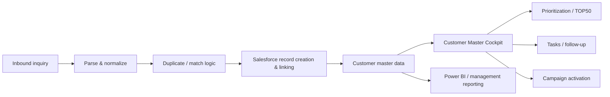

# GTM Systems Portfolio

Production-derived, anonymized examples of Revenue Operations / GTM Systems work spanning inbound automation, CRM architecture, Salesforce UX, customer prioritization, data quality, and sales workflow design.

> **Portfolio note**
> The examples in this repository are intentionally sanitized. Customer data, credentials, internal URLs, Salesforce org identifiers, company-specific field names, and proprietary implementation details have been removed or generalized. Representative code under `salesforce-cockpit/` reproduces verified production behavior at a portfolio-safe level; it is not a verbatim copy of the production codebase.

## What this portfolio demonstrates

I work at the intersection of **business operations and technical systems**: identifying operational friction, translating it into requirements and data rules, building or directing implementation, validating edge cases, and deploying changes into frontline sales workflows.

The production system behind these examples supported a multi-store sales organization and evolved from a narrow inbound automation into a broader GTM operating layer.

### Core capabilities

- **Inbound automation** — parse inbound inquiries, validate data, deduplicate, create/link CRM records, route ownership, and create follow-up tasks.
- **CRM architecture & data quality** — normalize customer data, resolve duplicate representations, enforce deterministic fallback logic, and define a clearer source of truth.
- **Salesforce UX** — custom Lightning Web Components for customer search, filtering, prioritization, record usability, and sales action.
- **Search & retrieval** — cross-field search across customer master data and historical inquiry/property relationships.
- **Prioritization & activation** — surface last activity, desired conditions, and inquiry context; promote customers to priority queues; create Tasks and controlled Campaign audiences.
- **Analytics** — Power BI reporting across acquisition spend, inquiries, contracts, and revenue.
- **Deployment discipline** — Salesforce CLI validation, regression scenarios, operational UAT, and iterative releases.

## System evolution



The important change was conceptual: Salesforce stopped being only a system of record and became an **operational decision surface**.

---

## Case 1 — Inbound Lead Automation

### Problem

Inbound real-estate inquiries required repetitive CRM entry and follow-up setup. The workflow also needed stronger duplicate handling, consistent record relationships, ownership routing, and safer retry behavior.

### Solution

A Google Apps Script workflow connected Gmail to Salesforce and automated:

1. message detection and parsing;
2. normalization and validation;
3. customer/property/inquiry matching;
4. duplicate-safe record creation;
5. ownership routing;
6. initial follow-up Task creation;
7. retry and idempotency controls.

Representative files already in this repository illustrate the parser, matching, Salesforce synchronization, and prioritization logic.

### Design principles

- **Idempotent execution:** retries must not create duplicate CRM records.
- **Deterministic matching:** normalize before comparing.
- **Safe failure:** ambiguous matches should be reviewable instead of silently overwriting records.
- **Operational observability:** log enough context to diagnose failures without exposing customer data.

---

## Case 2 — Customer Master Cockpit

### Problem

Useful Salesforce data existed, but frontline salespeople could not retrieve it the way they actually thought about customers. Customer attributes, historical inquiries, desired areas, stations, property context, and activity data were split across fields and related records.

### Solution

A custom Salesforce Lightning workspace translated the existing data model into sales-facing search and action.

Representative portfolio-safe code is in:

- `salesforce-cockpit/lwc/customerMasterCockpit/`
- `salesforce-cockpit/classes/CustomerMasterCockpitController.cls`

### Verified production behaviors represented here

- cross-field search across name, kana, phone, email, notes, areas, station/rail preferences, and desired conditions;
- hiragana/katakana normalization;
- phone normalization that ignores punctuation and supports partial lookup;
- historical inquiry coverage, not only the latest inquiry;
- deterministic inquiry-area resolution using structured data before legacy free text;
- explicit AND/OR combination behavior;
- mandatory safety exclusions that remain AND conditions even when business filters use OR;
- owner/status/budget/area/activity filters;
- direct activation into priority workflows, Tasks, and controlled Campaign audiences.

### Why this matters

This was not a "better list view." It was a translation layer between a legacy CRM schema and real sales decisions.

---

## Case 3 — CRM Data Quality & Sales Process Redesign

A field-level audit was used to distinguish:

- business-critical inputs;
- legacy / duplicated concepts;
- system-calculated fields;
- fields that should remain stored but not burden the editing experience.

The broader redesign included:

- clearer single-source-of-truth decisions;
- redesigned customer editing flows;
- postal-code-assisted address entry;
- structured rail/station preferences;
- duplicate detection using normalized contact data;
- clearer separation of customer, inquiry, residence, and desired-condition concepts;
- operational safety rules around contactability and workflow state.

The point was not to delete fields aggressively. It was to make the **data model usable and governable**.

---

## Case 4 — Prioritization & Sales Execution

Priority management was redesigned around observable customer and sales signals rather than purely subjective labels.

The workflow connected:

**search → context → priority → next action**

so that a customer found through the Cockpit could immediately move into:

- a priority queue;
- a follow-up Task;
- a controlled Campaign audience;
- a salesperson-owned next step.

---

## Validation & iteration

The production work was validated through Salesforce CLI dry runs, targeted tests, and operational UAT.

Representative regression scenarios included:

- geographic substring false positives;
- hiragana / katakana / kanji + furigana search behavior;
- hyphenated, plain, and partial phone-number matching;
- structured → legacy geography fallback order;
- cross-filter OR behavior with mandatory safety AND exclusions;
- inquiry-date fallback behavior across old and new records.

One validated release completed with:

- **25/25 metadata components validated**
- **14/14 tests passed**
- **0 test failures**

These figures refer to target-org validation and test pass rate, not 100% code coverage.

---

## My role

### I owned

- workflow/problem discovery;
- requirements and acceptance criteria;
- CRM/data-model decisions;
- search, safety, and UX behavior;
- operational UAT;
- deployment decisions;
- iteration priorities;
- measurement boundaries and what could / could not be claimed.

### AI-assisted development

AI was used as a development partner for:

- architecture exploration;
- Apex / LWC / Apps Script implementation support;
- debugging and refactoring;
- test-case generation and expansion;
- documentation.

I retained responsibility for requirements, system behavior, verification, and production deployment decisions.

---

## Technology

**Salesforce:** Person Accounts, Apex, Lightning Web Components, SOQL/SOSL, Tasks, Campaigns, Permission Sets, Salesforce CLI  
**Automation:** Google Apps Script, Gmail  
**Analytics:** Power BI, Excel / Google Sheets  
**Practices:** normalization, deduplication, deterministic fallback logic, UAT, regression testing, deployment validation

---

## Repository structure

```text
.
├── README.md
├── architecture/
│   └── system-overview.md
├── evidence/
│   └── validation-notes.md
├── salesforce-cockpit/
│   ├── classes/
│   │   └── CustomerMasterCockpitController.cls
│   └── lwc/
│       └── customerMasterCockpit/
│           ├── customerMasterCockpit.html
│           └── customerMasterCockpit.js
└── [existing inbound automation / matching / scoring examples]
```

## Confidentiality

This repository is a portfolio artifact, not a production source-code mirror. It intentionally omits company-confidential information, customer data, credentials, internal URLs, production org identifiers, and proprietary implementation details.
